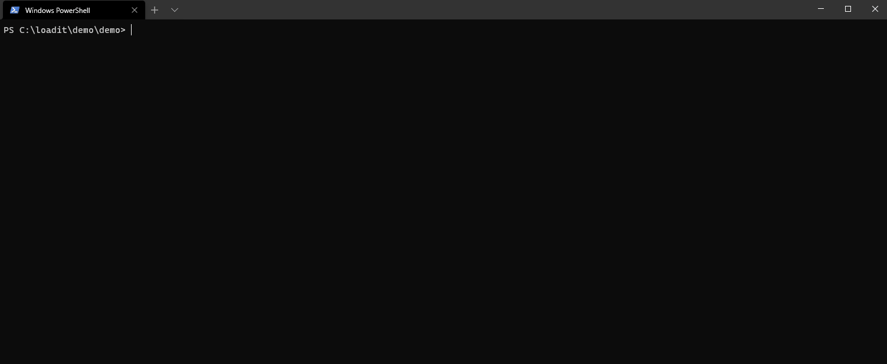

## Loadit

> Load testing tool providing the best .NET developer experience for API performance testing.

[](https://dev.azure.com/loadit/Loadit/_build/latest?definitionId=1) 

⚠️ **Help the project by voting for**:  [C# language proposal](https://github.com/dotnet/csharplang/issues/4163).

## What it is

Loadit is an open-source load testing tool built for making performance testing a productive and enjoyable experience.



See the [Quick start](https://lilbaek.github.io/loadit/#/quickstart) guide for more details.

## Features

- Write your tests in C#. ***No*** DSL, XML or untyped language.
- Simple and lightweight using .NET 5
- Everything as code
- CLI tool for easy testing
- Debugger included

## Use case

- Load testing
  - Create load tests with high load to find performance regressions and bottlenecks 
- Continues monitoring
  - Continuously monitor the performance of your environment to catch performance regressions before your users do

# Install

On Linux/Mac/Windows invoke the dotnet tool command:

```bash
dotnet tool install -g loadit
```

*Install [.NET 5](https://dotnet.microsoft.com/download/dotnet/5.0) first*

## Getting started

See the [Quick start](https://lilbaek.github.io/loadit/#/quickstart) guide

## Test example (Simple version - HTTP)

```c#
using Loadit;

return await Execute.Run<Http>(async (http, token) =>
{
    using var res = await http.GetAsync("https://test.loadit.dev/", token);
});
```

## Test example (Full version with more features)

```c#
using System;
using System.Threading;
using System.Threading.Tasks;
using Loadit;

return await Execute.Run<Test2>();

public class Test2 : LoadTest
{
    private readonly Http _http;

    public Test2(Http http)
    {
        _http = http;
    }

    public override async Task Run(CancellationToken token)
    {
        using var res = await _http.GetAsync("https://test.loadit.dev/", token);
    }
}
```
## Build from source

Loadit is written in C# targeting .NET 5. To build from source you need **[Git](https://git-scm.com/downloads)** and **[.NET 5](https://dotnet.microsoft.com/download/dotnet/5.0)**.
