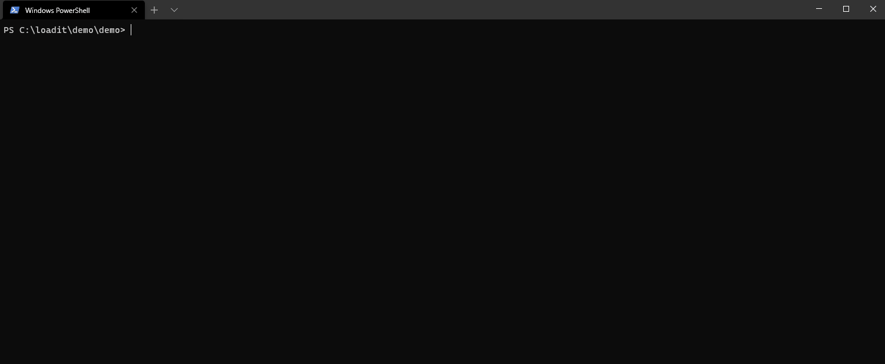

## Loadit

> Load testing tool providing the best .NET developer experience for API performance testing.

## What it is

Loadit is an open-source load testing tool built for making performance testing a productive and enjoyable experience.

See the [Quick start](quickstart.md) guide for more details.

⚠️ **Help the project by voting for: **. [C# language proposal](https://github.com/dotnet/csharplang/issues/4163).

## Features

- Write your tests in C#. ***No*** DSL, XML or untyped language.
- Simple and lightweight using .NET 5
- Everything as code
- CLI tool for easy use
- Debugger included

## Use case

- Load testing
  - Create load tests with high load to find performance regressions and bottlenecks 
- Continues monitoring
  - Continuously monitor the performance of your environment to catch performance regressions before your users do