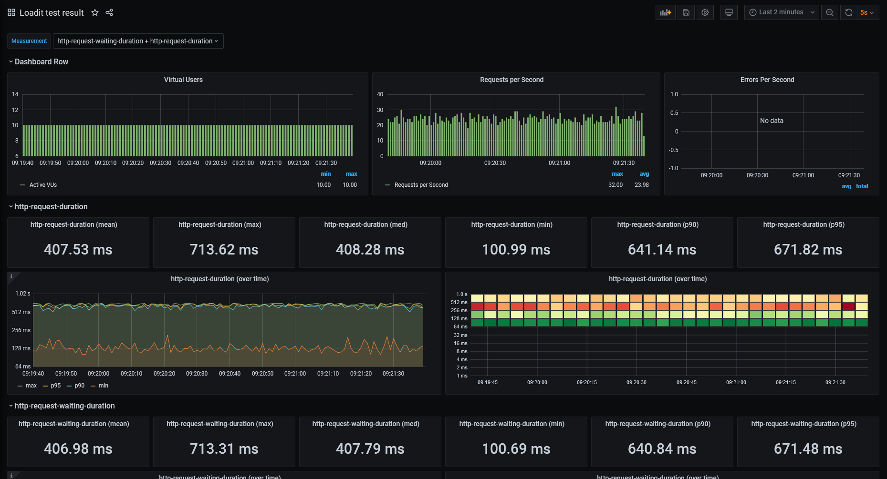
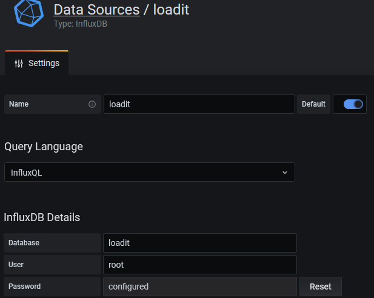

# InfluxDB + Grafana

You can use Grafana for visualization of the metrics data collected by Loadit.

The first step is to upload metrics data the InfluxDB, next you will need to either configure or import a Grafana dashboard for showing the data.

## Prerequisite

To get started either install [InfluxDB](https://archive.docs.influxdata.com/influxdb/v1.2/introduction/installation/) and [Grafana](https://grafana.com/docs/grafana/latest/installation/) or use a Docker Image like [docker-influxdb-grafana](https://hub.docker.com/r/philhawthorne/docker-influxdb-grafana/). 

*If you are new to InfluxDB/Grafana I recommend using the docker image as a quick start.*

## Upload metrics data

To upload metrics data during a run edit the appsettings.json file located in the test directory and add the InfluxDB section:

```json
{
  "InfluxDB": {
    "Url": "http://localhost:8086",
    "Username": "root",
    "Password": "root",
    "Database": "loadit",
    "Interval": 1000
  }
}
```

Run the test while specifying the --out argument:

```bash
loadit --run --out influxdb --file LoadTest.cs
```

## Configure Grafana datasource

Open the Grafana dashboard (Either http://localhost:3000 or http://localhost:3003 by default) and create a new datasource:


## Visualize data using a dashboard

You can find a preconfigured dashboard on github: https://github.com/lilbaek/loadit/tree/main/thirdparty/grafana

You can customize it as required or create a completely new one.

