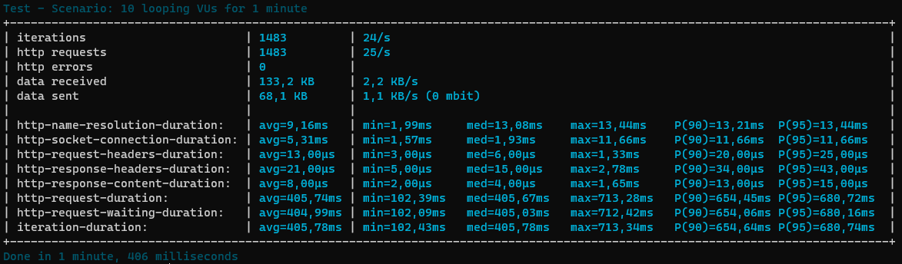

# Metrics

Loadit collects a number of different metrics during a run. The metrics can be used to do visualization or as a summary after a run.

Most metrics are collected using the telemetry providing by .NET. See: https://github.com/dotnet/runtime/issues/37428#issuecomment-674597327

## Metric descriptions

| Name                            | Description (Telemetry name is parentheses)                  |
| ------------------------------- | ------------------------------------------------------------ |
| http-name-resolution-duration   | DNS resolution time (NameResolution.ResolutionStart)         |
| http-socket-connection-duration | Time spent on doing socket connection (Sockets.ConnectStart) |
| http-tls-handshake-duration     | TLS handshake duration (Security.HandshakeStart)             |
| http-request-headers-duration   | Time to send headers (Http.RequestHeadersStart)              |
| http-request-content-duration   | Time to send content (Http.RequestContentStart)              |
| http-response-headers-duration  | Time to receive headers (Http.ResponseHeadersStart)          |
| http-response-content-duration  | Time to receive content (Http.ResponseContentStart)          |
| http-request-waiting-duration   | Time waiting for the remote host to return the first content.  (RequestHeadersStop/RequestContentStop and ResponseHeadersStart difference) |
| http-request-duration           | Total duration of a request. This includes: NameResolution.ResolutionStart Sockets.ConnectStart Security.HandshakeStart Http.RequestHeadersStart Http.RequestContentStart Http.ResponseHeadersStart Http.ResponseContentStart Http.RequestStop |
| iteration-duration              | Time of each "run" iteration                                 |
| http-requests-count             | Number of outgoing requests                                  |
| bytes-sent                      | Total data send during lifetime of process                   |
| bytes-received                  | Total data received during lifetime of process               |
| http-errors                     | Total number of http errors as reported by the event: Http.RequestFailed |
| vus                             | Number of VUs                                                |
| iterations-count                | Total number of run iterations                               |

