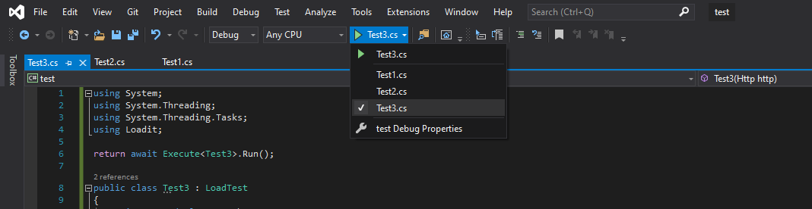

# Visual Studio integration

To easily run and debug tests loadit creates specific launch profiles to target your test files.

Add your tests and switch between them easily from the Run button dropdown or by changing files in the editor:

The list is updated as you add/remove files from the project. When you select a dropdown entry the test file becomes the only top-level program to be complied. 

All files in the test project are considered top-level programs. If you need to share code between them you will need to do it in the *.lib project.

## Debugging

After selecting a test from the dropdown you can debug it as you normally would using F5.

## Known issues

**Yellow message**

You may experience a yellow bar with the message "An exception of type ArgumentNullException" has been encountered. This happens from time to time and the strack trace indicates that it is due to Roslyn not liking the include/exclude of files.

**Nothing happens when changing files**

When Visual Studio loads it sometimes "forgets" to call the msbuild task code that setups the integration. If nothing happens when you switch files in the editor rebuild the project once to trigger the integration code. 